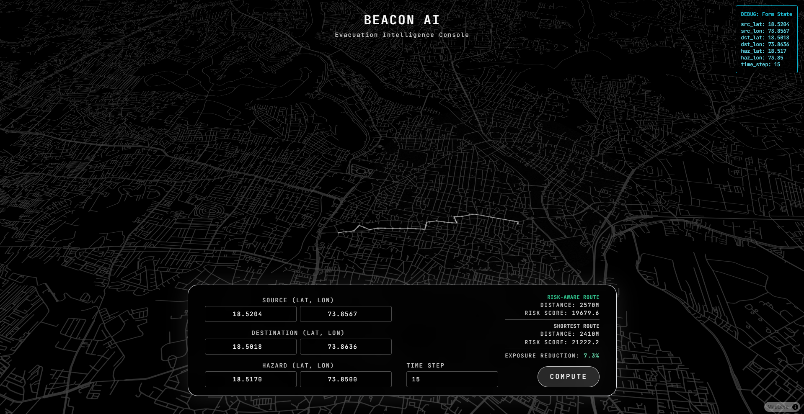

# BeaconAI Evacuation Intelligence

**BeaconAI** is a full‑stack demonstration of a real‑time, risk‑aware evacuation planner. Using a clean, dark‑mode map interface, users can enter source, destination and hazard coordinates then compute two routes:

1. a **risk‑aware** path that avoids danger zones, and
2. the **shortest** path for comparison.

Both routes are rendered on a stylized MapLibre map, with a hazard polygon overlay and live metrics showing distance, risk score and exposure reduction.



## Features

- Dual‑route visualization (safe vs. shortest)
- Animated map that orbits on startup and locks on compute
- Hazard zone with noise pattern overlay
- Responsive input panel with live debug information
- FastAPI backend computing routes via osmnx/NetworkX
- Metrics display showing risk comparison

## Getting Started

### Prerequisites

- Python 3.10+ (venv recommended)
- Node.js 18+

### Backend

```bash
cd backend
python -m venv venv
venv\Scripts\activate  # Windows
pip install -r ../requirements.txt

uvicorn backend.main:app --reload --host 0.0.0.0 --port 8000
```

The server exposes a single POST endpoint `/evacuate` accepting a JSON payload:

```json
{
  "source_lat": ..., "source_lon": ..., 
  "dest_lat": ..., "dest_lon": ..., 
  "hazard_lat": ..., "hazard_lon": ..., 
  "time_step": 1
}
```

It returns both route geometries, metrics, and hazard data.

### Frontend

```bash
cd frontend
npm install
npm run dev
```

Open [http://localhost:5173](http://localhost:5173) and interact with the map.

## Project Structure

```
backend/            # FastAPI application and evacuation logic
frontend/           # Vite + React + MapLibre UI
  src/              # components, API wrapper, styles
  public/           # static assets
tests/              # (optional) unit tests
```

## Customization

- Swap map style in `BeaconMap.tsx`
- Replace hazard model with real data
- Add user authentication or persistent storage

## License

MIT © dev
